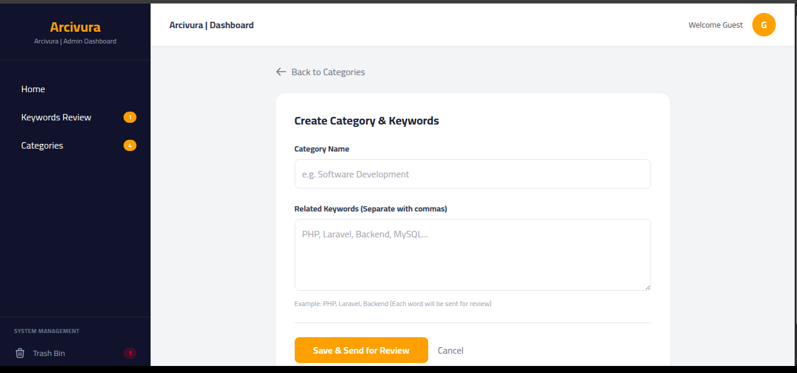
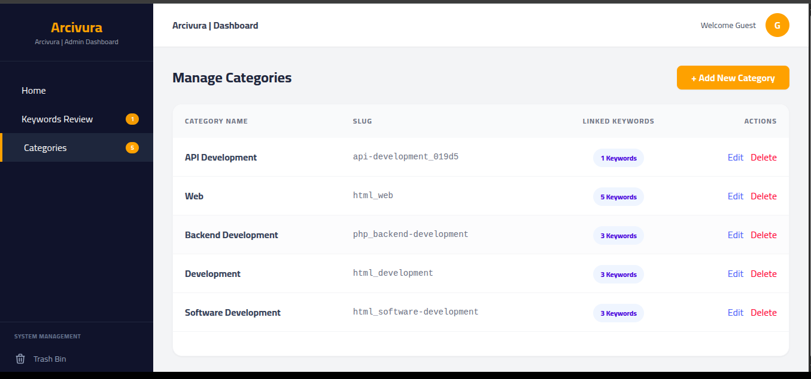
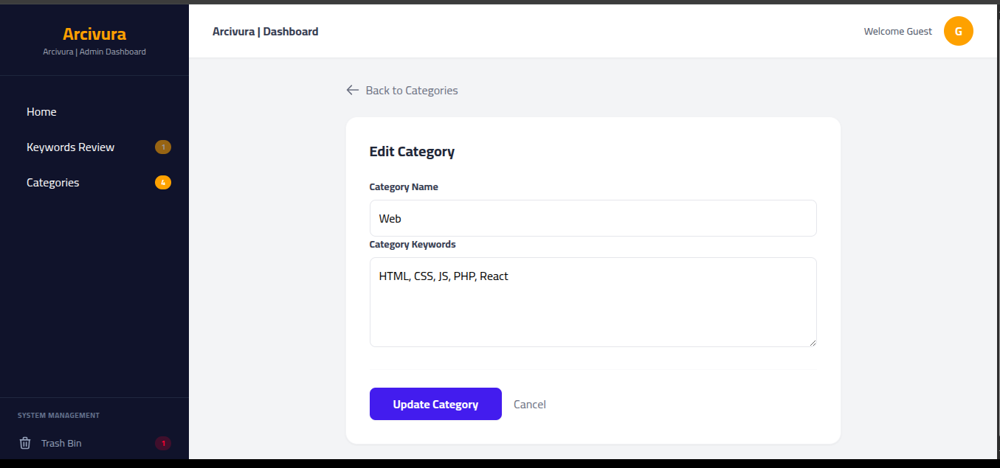
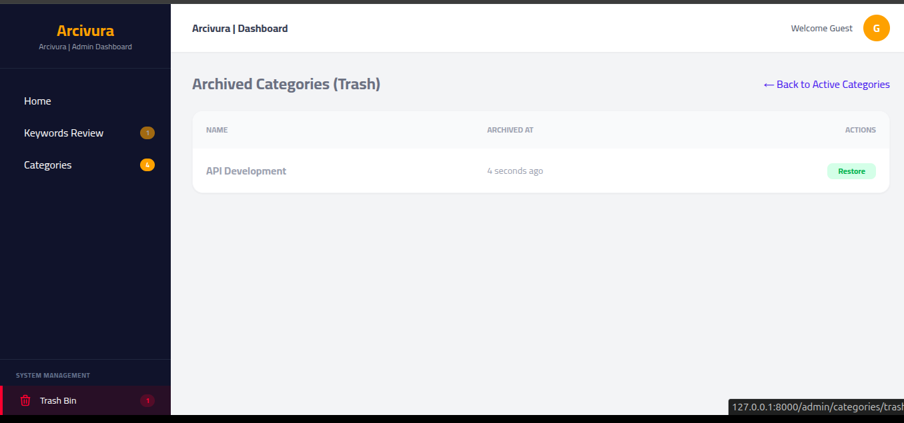
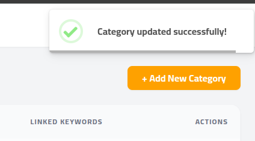
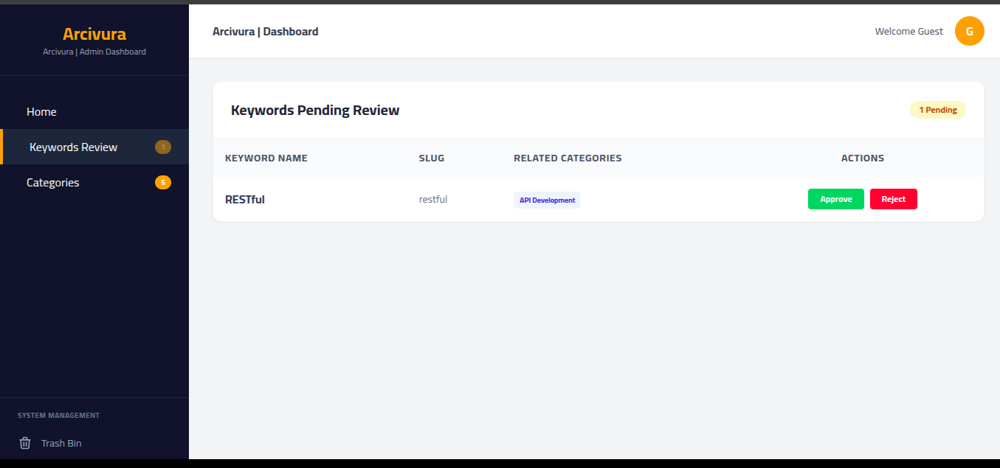
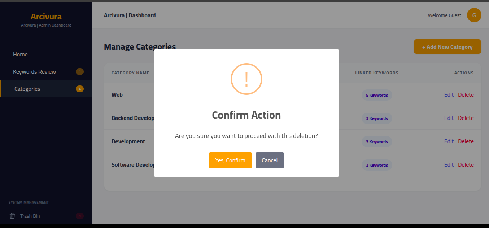

<p align="center">
  <a href="#" target="_blank">
    
  </a>
</p>

<h1 align="center">Arcivura: AI-Powered Talent Ecosystem</h1>

<p align="center">
<a href="#"></a>
<a href="#"></a>
<a href="#"></a>
<a href="#"></a>
</p>


# 🚀 Arcivura: AI-Powered Talent Ecosystem

## About Arcivura

**Arcivura** is an advanced, AI-driven recruitment ecosystem designed to bridge the gap between top-tier talent and industry leaders. By merging architectural precision with AI-powered vision, it transforms traditional hiring into a data-driven, automated experience.

The system is built on a **Dual-App Architecture** using Laravel 13, featuring:

- **SmartRoute AI:** Semantic resume parsing and automated job matching using Google Gemini Pro.
- **Architectural Integrity:** Full UUID implementation for enhanced security and resource protection.
- **Enterprise Ready:** A comprehensive Backoffice ERP for company management and talent analytics.
- **Real-time Engine:** Instant notifications and background processing via Laravel Reverb.


---

## 🏛️ System Architecture
The project is engineered as a **Dual-App Ecosystem** sharing a unified core:
- **Client Portal (Job-App):** Optimized for Job Seekers to manage AI-enhanced resumes and track applications.
- **Enterprise Dashboard (Backoffice):** A full-scale ERP for Admins and Company Owners to manage talent pipelines and analytics.
- **Shared Core:** A single, hardened MySQL database and shared storage for seamless data consistency.

## ✨ Key Technical Innovations

### 🧠 SmartRoute AI Matching
Unlike traditional keyword search, Arcivura uses NLP to:
- Parse complex PDF resumes into structured JSON data.
- Calculate a **Match Score** based on semantic relevance, not just word count.
- Provide automated feedback to applicants through the AI feedback engine.

### 🔐 Security & Engineering Standards
- **UUID Primary Keys:** All public-facing IDs use UUIDs to prevent ID enumeration attacks.
- **RBAC (Role-Based Access Control):** Granular permission system (SuperAdmin, Admin, Owner, Seeker).
- **Soft Deletes:** Full data archival support across all major entities.
- **Audit Logging:** Every administrative action is captured with IP, User-Agent, and Payload tracking.

## 📊 Database Schema Overview
The database is designed for high-concurrency and deep analytics:
- **Optimized Indexing:** Strategic indexes on `ai_score`, `slug`, and `status` for lightning-fast filtering.
- **Relational Integrity:** Strict foreign key constraints with `Restrict` rules to ensure data consistency.
- **JSON Fields:** Flexible storage for parsed resume data and dynamic job requirements.

## 🛠️ Tech Stack
- **Framework:** Laravel 13 (PHP 8.5)
- **Frontend:** Blade Templating Engine & Tailwind CSS
- **Authentication:** Custom Laravel Breeze (MVC Pattern)
- **Database:** MySQL 8.5
- **AI Engine:** Google Gemini Pro API
- **Real-time:** Laravel Reverb (WebSockets)
  
### git clone https://github.com/engAhmedEwas/Arcivura--AI-Powered-Talent-Ecosystem.git

## 🚀 Installation & Setup

# Install PHP dependencies
```bash
  composer install
```

# Setup environment
```bash
  cp .env.example .env
  php artisan key:generate
```

# Run migrations
```bash
  php artisan migrate
```
>>>>>>> 1421eddee74395371e60ed1f3c2b55ca260b73ae

## 🚩 Project Status: Initial Launch (MVP)
**Current Version:** 0.1.0-alpha  
**Status:** In Active Development 🛠️

> "Arcivura is currently in its initial architectural phase. We are focusing on establishing a rock-solid foundation with Laravel 13, preparing for the upcoming AI integration layer."

### 🗺️ Roadmap
- [x] Database Schema & Migrations (UUID Based)
- [ ] Core Models & RBAC Implementation (Current Phase)
- [ ] Gemini AI Resume Parsing Engine
- [ ] Job Matching Algorithm (SmartRoute)


---------------------------------------------------------------------------------------------------------

# 🚀 Arcivura Admin Dashboard Category Section

**Arcivura** هو نظام إداري متطور مبني باستخدام **Laravel 12**، مصمم لإدارة التصنيفات (Categories) والكلمات المفتاحية (Keywords) بدقة عالية. يتميز النظام بواجهة مستخدم عصرية، نظام تنبيهات تفاعلي، وإدارة كاملة للمحتوى المؤرشف.

---

## ✨ المميزات الرئيسية
* **إدارة الأقسام (CRUD):** إضافة، تعديل، وعرض الأقسام مع ربطها بكلمات مفتاحية متعددة.
* **نظام المراجعة الذكي:** الكلمات المفتاحية المضافة تدخل في حالة "قيد الانتظار" (Pending) للمراجعة من قبل المسؤول.
* **الأرشفة (Soft Deletes):** نظام سلة مهملات متكامل لاستعادة البيانات أو حذفها نهائياً.
* **تنبيهات SweetAlert2:** تجربة مستخدم سلسة مع تنبيهات فورية لحالات النجاح، الخطأ، والتحذير.
* **UI احترافي:** Sidebar و Top Bar ثابتين لسهولة التنقل، مع تصميم متجاوب.

---

## 📸 معرض الصور (Screenshots)

|                الأساسيات          |               العمليات                   |
| --------------------------------- | ---------------------------------------- |
|            |
|  |
|        |
|     |

|           النظام المتقدم      |               التنبيهات                  |
| ----------------------------- | ---------------------------------------- |
|                  |
|          |
|      |
|  |

---

## 🎥 فيديو توضيحي (Demo)
يمكنك مشاهدة النظام وهو يعمل بشكل كامل (إضافة، تعديل، أرشفة، ومراجعة) من خلال الرابط أدناه:
| 

---

## 🛠️ التقنيات المستخدمة
- **Framework:** Laravel 13 && php 8.5.0
- **Frontend:** Tailwind CSS, Blade Templates
- **Database:** MySQL (with Soft Deletes)
- **Interactive UI:** SweetAlert2, JavaScript (Event Delegation)
- **Architecture:** PHP Enums for Roles & Status

--------------------------------------------------------------------------------------------------------
## 🚀 Installation & Setup

### git clone https://github.com/engAhmedEwas/Arcivura--AI-Powered-Talent-Ecosystem.git

# Install PHP dependencies
```bash
  composer install
```

# Setup environment
```bash
  cp .env.example .env
  php artisan key:generate
```

# Run migrations
```bash
  php artisan migrate
```
-----------------------------------------------------------------------------------------------------