<p align="center">
  <a href="#" target="_blank">
    
  </a>
</p>

<h1 align="center">Arcivura: AI-Powered Talent Ecosystem</h1>

<p align="center">
<a href="#"></a>
<a href="#"></a>
<a href="#"></a>
<a href="#"></a>
</p>


# 🚀 Arcivura: AI-Powered Talent Ecosystem

## About Arcivura

**Arcivura** is an advanced, AI-driven recruitment ecosystem designed to bridge the gap between top-tier talent and industry leaders. By merging architectural precision with AI-powered vision, it transforms traditional hiring into a data-driven, automated experience.

The system is built on a **Dual-App Architecture** using Laravel 13, featuring:

- **SmartRoute AI:** Semantic resume parsing and automated job matching using Google Gemini Pro.
- **Architectural Integrity:** Full UUID implementation for enhanced security and resource protection.
- **Enterprise Ready:** A comprehensive Backoffice ERP for company management and talent analytics.
- **Real-time Engine:** Instant notifications and background processing via Laravel Reverb.


---

## 🏛️ System Architecture
The project is engineered as a **Dual-App Ecosystem** sharing a unified core:
- **Client Portal (Job-App):** Optimized for Job Seekers to manage AI-enhanced resumes and track applications.
- **Enterprise Dashboard (Backoffice):** A full-scale ERP for Admins and Company Owners to manage talent pipelines and analytics.
- **Shared Core:** A single, hardened MySQL database and shared storage for seamless data consistency.

## ✨ Key Technical Innovations

### 🧠 SmartRoute AI Matching
Unlike traditional keyword search, Arcivura uses NLP to:
- Parse complex PDF resumes into structured JSON data.
- Calculate a **Match Score** based on semantic relevance, not just word count.
- Provide automated feedback to applicants through the AI feedback engine.

### 🔐 Security & Engineering Standards
- **UUID Primary Keys:** All public-facing IDs use UUIDs to prevent ID enumeration attacks.
- **RBAC (Role-Based Access Control):** Granular permission system (SuperAdmin, Admin, Owner, Seeker).
- **Soft Deletes:** Full data archival support across all major entities.
- **Audit Logging:** Every administrative action is captured with IP, User-Agent, and Payload tracking.

## 📊 Database Schema Overview
The database is designed for high-concurrency and deep analytics:
- **Optimized Indexing:** Strategic indexes on `ai_score`, `slug`, and `status` for lightning-fast filtering.
- **Relational Integrity:** Strict foreign key constraints with `Restrict` rules to ensure data consistency.
- **JSON Fields:** Flexible storage for parsed resume data and dynamic job requirements.

## 🛠️ Tech Stack
- **Language:** PHP 8.5+
- **Framework:** Laravel 13 (PHP 8.5)
- **Frontend:** Blade Templating Engine & Tailwind CSS
- **Authentication:** Custom Laravel Breeze (MVC Pattern)
- **Database:** MySQL 8.5 (Optimized with UUIDs, Indexing and soft Delerte)
- **Interactive UI:** SweetAlert2, JavaScript (Event Delegation)
- **Architecture:** PHP Enums for Roles & Status
- **AI Engine:** Google Gemini Pro API
- **Real-time:** Laravel Reverb Ready

## ✨ Key Technical Features
* **Intelligence Registry:** Advanced management for Categories and Keywords with a "Pending-Review" state machine.
* **Architectural Integrity:** Full **UUID** implementation for primary keys to prevent ID enumeration and enhance security.
* **Data Resiliency:** Integrated **Soft Deletes** for all critical entities with a dedicated Trash Management system.
* **Interactive UX:** Real-time notifications powered by **SweetAlert2** and an event-driven UI.
* **Modern Backend:** Leveraging PHP 8.5 **Enums** for Type-safety in Roles and Status management.


## 🚩 Project Status: Initial Launch (MVP)
**Current Version:** 0.3.0-alpha  
**Status:** In Active Development 🛠️

> "Arcivura is currently in its initial architectural phase. We are focusing on establishing a rock-solid foundation with Laravel 13, preparing for the upcoming AI integration layer."

## 🔍 Current Implementation & Achievements
In the current development phase, I have successfully engineered the core administrative backbone of **Arcivura**, focusing on data integrity and scalable architecture:

### 1. Advanced Category & Keyword Engine
- **Relational Mapping:** Implemented a robust One-to-Many relationship between Categories and Keywords.
- **Intelligence Review Workflow:** Developed a state-driven system where new keywords are flagged as `Pending` for administrative moderation, ensuring data quality for future AI training.
- **Event-Driven UI:** Leveraged **JavaScript Event Delegation** to handle dynamic keyword inputs and deletions without page reloads.

### 2. Enterprise-Grade Security
- **UUID Integration:** Migrated from auto-incrementing IDs to **UUID v4** across all models to mitigate "Insecure Direct Object Reference" (IDOR) vulnerabilities.
- **Type-Safe Logic:** Utilized **PHP 8.5 Enums** to handle Roles and Statuses, reducing runtime errors and improving code readability.

### 3. Data Safety & Archival
- **Soft Delete Pattern:** Implemented a comprehensive "Trash Bin" system, allowing for data recovery and preventing accidental permanent loss of enterprise resources.
- **Audit-Ready Dashboards:** Designed a responsive interface using **Tailwind CSS** that provides real-time feedback through **SweetAlert2** integrations.

### 🗺️ Roadmap
- [x] Database Schema & Migrations (UUID Based)
- [ ] Core Models & RBAC Implementation (Current Phase)
- [ ] Gemini AI Resume Parsing Engine
- [ ] Job Matching Algorithm (SmartRoute)


---

## 📽️ Admin Dashboard Showcase
The current phase focuses on the **Backoffice ERP Engine**, managing core data entities with high integrity and real-time feedback.


## 📸 System Architecture in Action

|                الأساسيات             |                   العمليات                   |
| ------------------------------------ | -------------------------------------------- |
| 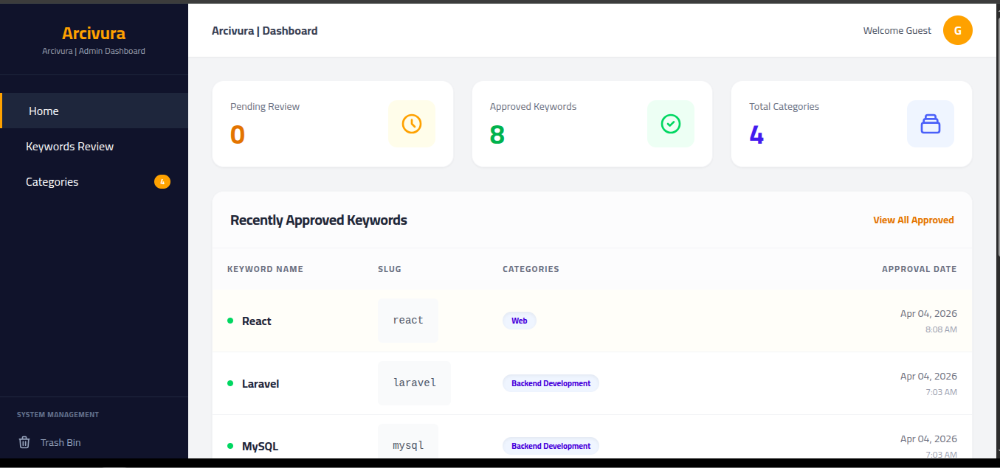                  |
| 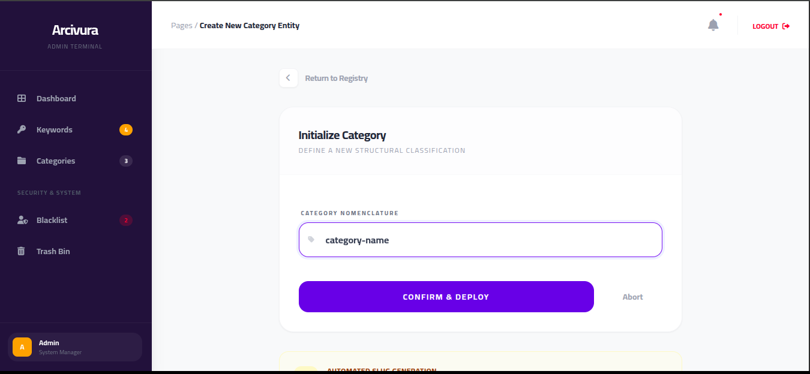                |
| 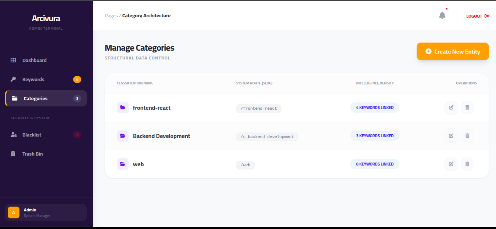            |
| 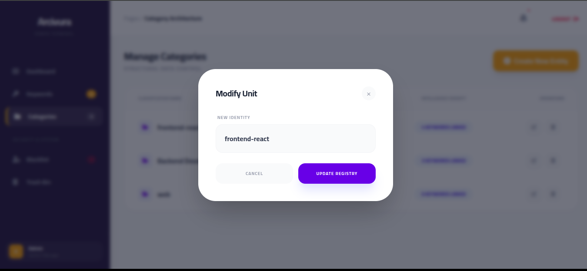          |
| 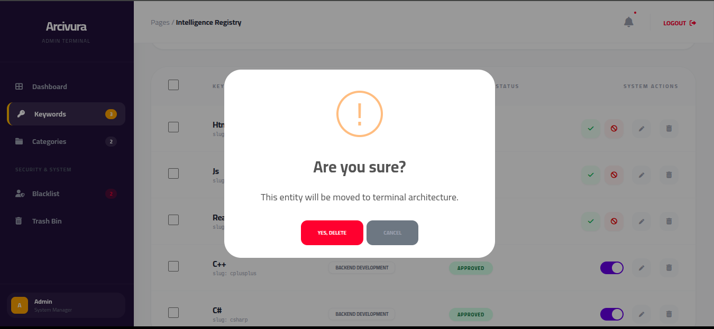                            |                           
| 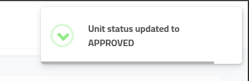                    |

|               النظام المتقدم         |                 التنبيهات                    |
| ------------------------------------ | -------------------------------------------- |
| 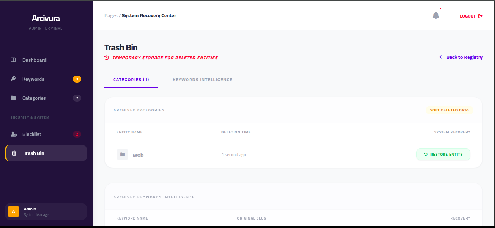                          |
| 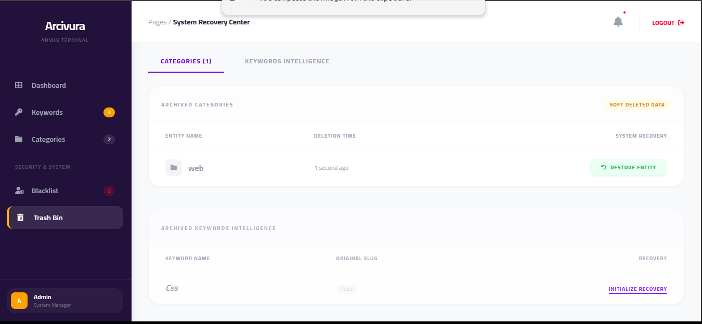                          |
| 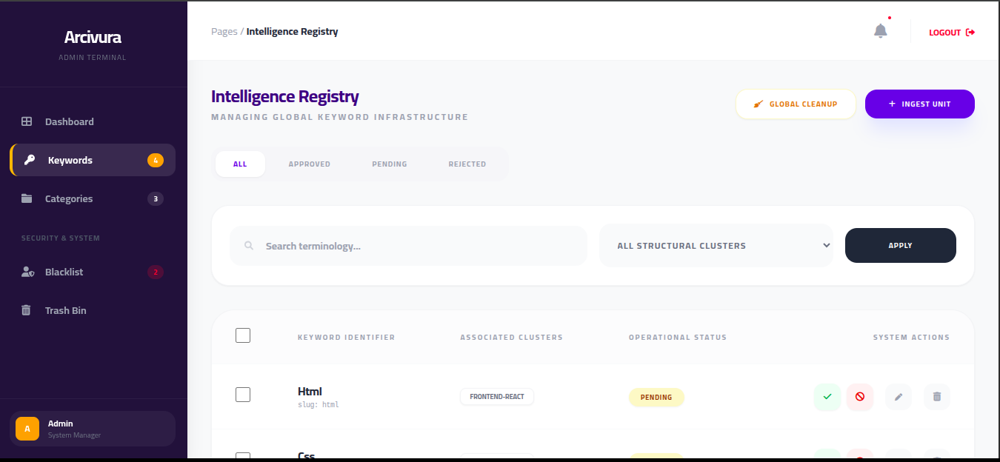                      |
| 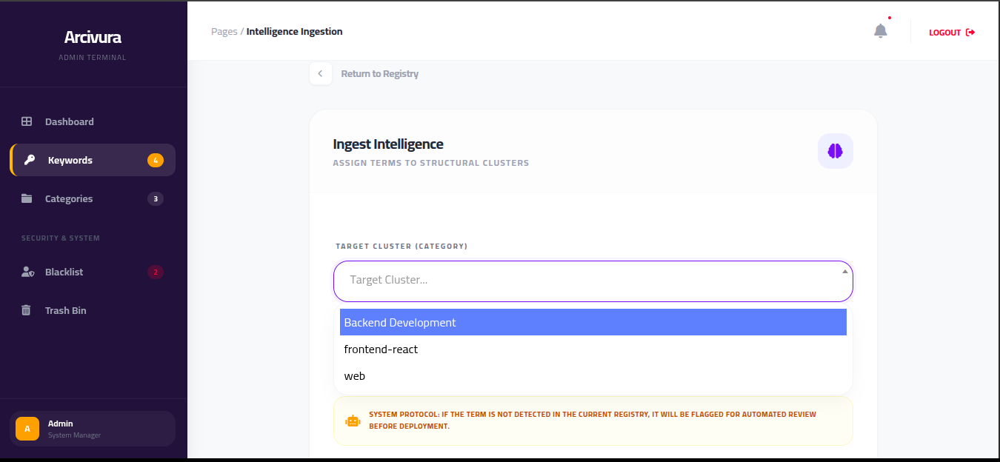                 |
| 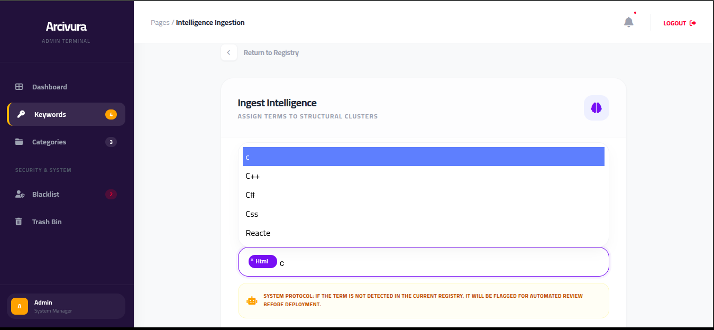               |
| 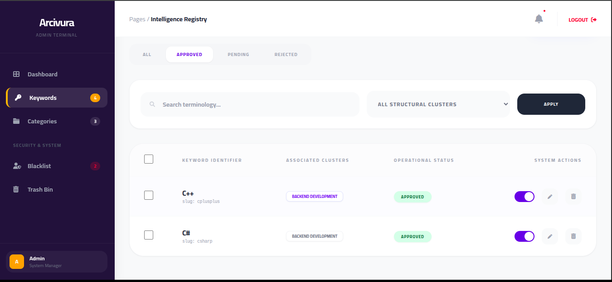     |
| 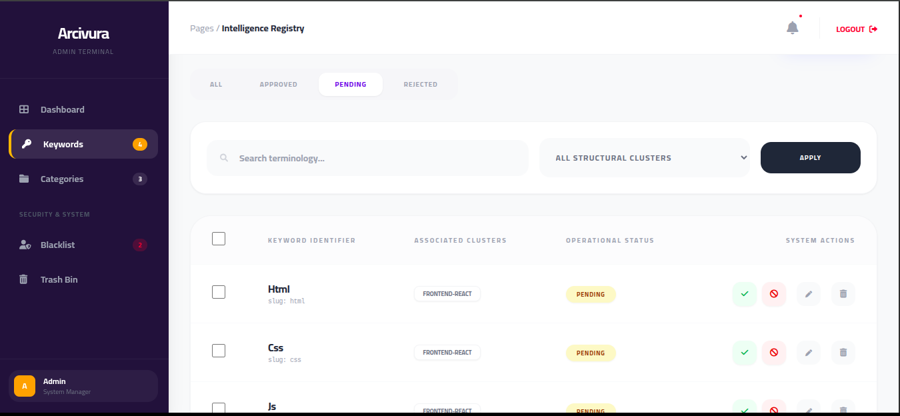   |
| 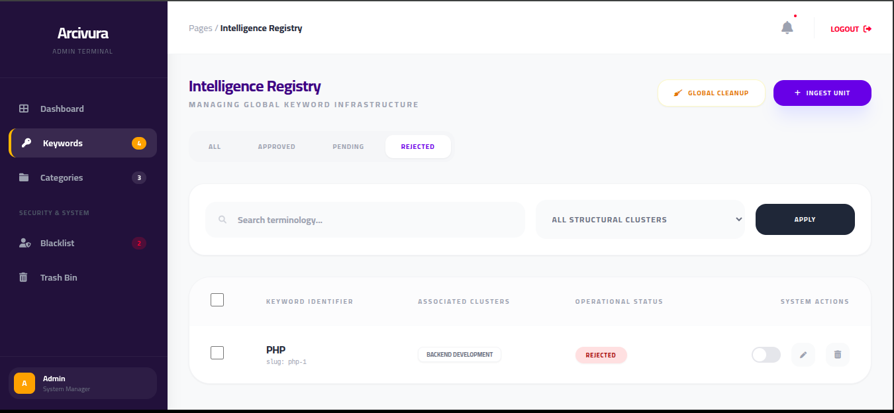 |
|               | 

---

## 🎥 Feature Demo
يمكنك مشاهدة النظام وهو يعمل بشكل كامل (إضافة، تعديل، أرشفة، ومراجعة) من خلال الرابط أدناه:
| 


---
## 🚀 Installation & Setup

### git clone https://github.com/engAhmedEwas/Arcivura--AI-Powered-Talent-Ecosystem.git

# Install PHP dependencies
```bash
  composer install
```

# Setup environment
```bash
  cp .env.example .env
  php artisan key:generate
```

# Run migrations
```bash
  php artisan migrate
```
---